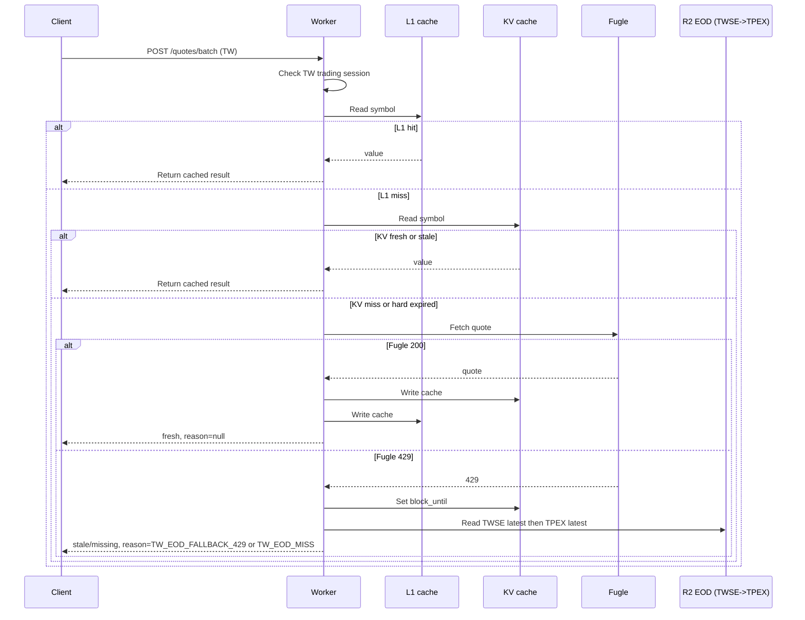
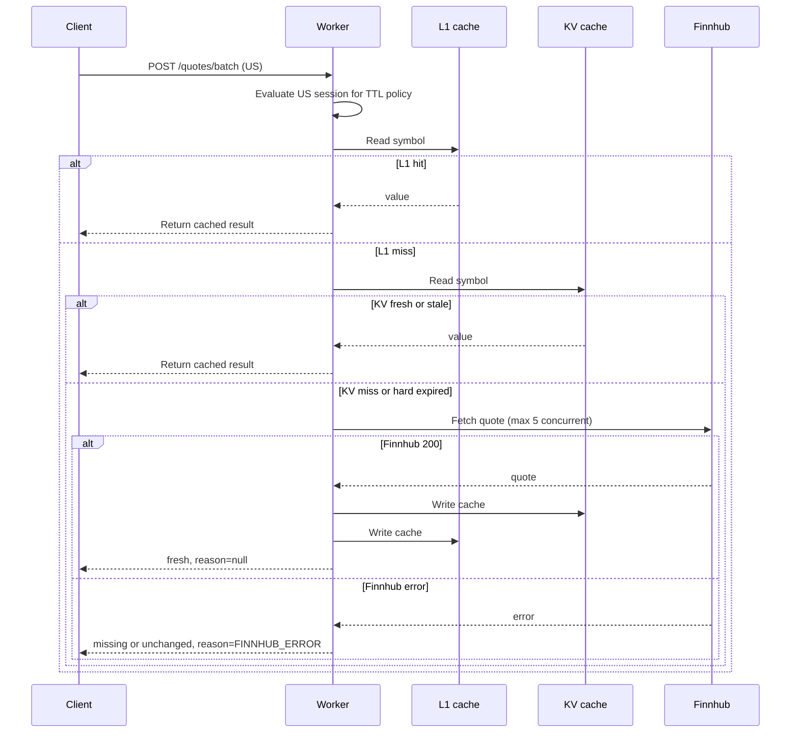

# Quote Worker

Cloudflare Worker that serves batch TW and US stock quotes via Fugle (TW) and Finnhub (US) with KV-backed caching. The worker returns results immediately with a freshness status (`fresh`, `stale`, or `missing`), fetches only a limited number of cache misses per request, and supports TWSE/TPEX end-of-day fallback from R2.

## What the project does

- Provides API endpoints for quote queries and manual TWSE/TPEX EOD refresh.
- Normalizes symbols (supports input like `2330`, `2330.TW`, or `TW:2330` for Taiwan; `AAPL`, `AAPL.US`, or `US:AAPL` for US).
- Uses two-layer caching: in-memory L1 and Cloudflare KV.
- Stores separate TWSE/TPEX end-of-day snapshots in Cloudflare R2.
- Applies soft/hard TTL policies that change during TW trading hours.
- Fetches TW quotes from Fugle API and US quotes from Finnhub API with a concurrency limit of 5 for US requests.
- During TW off-hours, serves TW quotes from EOD snapshots (query order: TWSE first, then TPEX) instead of calling Fugle.
- During TW trading hours, if Fugle returns `429`, temporarily blocks Fugle calls and falls back to EOD snapshots (TWSE first, then TPEX).

## Why the project is useful

- Low-latency batch quote responses suitable for downstream services.
- Predictable cache behavior with clear freshness signaling.
- Simple configuration through Worker environment variables.

## How users can get started

### Prerequisites

- Node.js 18+ (recommended).
- Cloudflare Wrangler CLI (installed via dev dependencies).
- A Fugle API key (for TW market).
- A Finnhub API key (for US market).

### Setup

1. Install dependencies.

	 ```bash
	 npm install
	 ```

2. Create a `.dev.vars` file with your API keys:

	 ```bash
	 FUGLE_API_KEY=your_fugle_api_key_here
	 FINNHUB_API_KEY=your_finnhub_api_key_here
	 OFFHOURS_OPEN_BUFFER_SEC=180
	 ```

3. Update KV/R2 binding IDs and names in [wrangler.jsonc](wrangler.jsonc).

4. Start the local dev server:

	 ```bash
	 npm run dev
	 ```

#### Deployment secrets (Cloudflare)

For production deployments, you must set API keys as Worker secrets in your Cloudflare environment. Otherwise US quotes will return `FINNHUB_ERROR` and `null` fields.

```bash
wrangler secret put FUGLE_API_KEY
wrangler secret put FINNHUB_API_KEY
wrangler secret put ADMIN_REFRESH_TOKEN
```

If you deploy to multiple environments, repeat the secret setup per environment.

### Usage

`POST /quotes/batch`

Request body (TW example):

```json
{
	"symbols": ["2330", "2317.TW"],
	"market": "TW"
}
```

Request body (US example):

```json
{
	"symbols": ["AAPL", "MSFT", "NVDA.US"],
	"market": "US"
}
```

Response:

```json
{
	"serverTime": "2026-01-26T00:00:00.000Z",
	"results": [
		{
			"symbol": "2330",
			"canonicalSymbol": "2330.TW",
			"market": "TW",
			"price": 590,
			"currency": "TWD",
			"asOf": "2026-01-26T00:00:00.000Z",
			"fetchedAt": "2026-01-26T00:00:01.000Z",
			"ttlHardSec": 300,
			"expiresAt": "2026-01-26T00:05:01.000Z",
			"status": "fresh",
			"isStale": false,
			"reason": null
		}
	]
}
```

#### Response fields

- `serverTime`: Server response time in ISO format.
- `results`: Array of quote results by symbol.
- `symbol`: Original input symbol.
- `canonicalSymbol`: Normalized symbol (`TICKER.TW` or `TICKER.US`).
- `market`: Market (`TW` or `US`).
- `price`: Latest price (or `null`).
- `currency`: Currency (TW defaults to `TWD`, US defaults to `USD`).
- `asOf`: Quote timestamp from the source (ISO).
- `fetchedAt`: Cache write time (ISO).
- `ttlHardSec`: Hard TTL (seconds) stored with the cached value.
- `expiresAt`: Cache expiry time (ISO) derived from `fetchedAt + ttlHardSec`.
- `status`: `fresh`, `stale`, or `missing`.
- `isStale`: Whether the value exceeded the soft TTL.
- `reason`: One of `KV_MISS`, `HARD_EXPIRED`, `FUGLE_ERROR`, `FINNHUB_ERROR`, `TW_EOD_OFFHOURS`, `TW_EOD_FALLBACK_429`, `TW_EOD_MISS`, or `null`.

### Curl example

TW market:

```bash
curl -X POST http://127.0.0.1:8787/quotes/batch \
	-H "Content-Type: application/json" \
	-d '{"symbols":["2330","2317"],"market":"TW"}'
```

US market:

```bash
curl -X POST http://127.0.0.1:8787/quotes/batch \
	-H "Content-Type: application/json" \
	-d '{"symbols":["AAPL","MSFT","NVDA"],"market":"US"}'
```

Manual TWSE/TPEX EOD refresh:

```bash
curl -X POST http://127.0.0.1:8787/admin/twse/eod/refresh \
	-H "X-Admin-Token: <your_admin_refresh_token>"
```

Manual refresh response now returns source-level results:
- `ok`: at least one source succeeded
- `partial`: only one source succeeded
- `twse`: `{ updated, tradingDate, quoteCount, deletedCount, error? }`
- `tpex`: `{ updated, tradingDate, quoteCount, deletedCount, error? }`
	- `error` appears only when refresh fails and there is no usable snapshot for that source.

### Quote flow by market and session

This section describes runtime quote lookup behavior for `POST /quotes/batch` by market and session window.

#### TW market in trading session

- Trading session is controlled by `TW_OPEN` and `TW_CLOSE` (default `09:00-13:30`, Asia/Taipei).
- Lookup order:
	- L1 in-memory cache
	- KV cache
	- Fugle API (only for unresolved symbols, up to `MAX_SYNC_FETCH`)
- If Fugle returns `429`:
	- Worker writes `sys:tw:fugle:block_until` to KV for `TW_429_BLOCK_SEC`.
	- Current request remaining TW symbols immediately fallback to R2 EOD chain (`TWSE -> TPEX`).
	- Requests during block window skip Fugle and directly use the same R2 fallback chain.
- Typical response mapping:
	- Fugle hit: `status=fresh`, `reason=null`
	- 429 fallback hit: `status=stale`, `reason=TW_EOD_FALLBACK_429`
	- 429 fallback miss: `status=missing`, `reason=TW_EOD_MISS`



#### TW market in off-hours

- Off-hours means outside `TW_OPEN-TW_CLOSE`.
- If `TW_EOD_R2` is configured, TW symbols bypass L1/KV/Fugle and directly use R2 EOD chain:
	- `twse/eod/latest.json` first
	- then `tpex/eod/latest.json`
- If `TW_EOD_R2` is not configured, Worker falls back to normal L1/KV/API flow.
- Typical response mapping:
	- EOD hit: `status=fresh`, `reason=TW_EOD_OFFHOURS`
	- EOD miss: `status=missing`, `reason=TW_EOD_MISS`

#### US market in trading session and off-hours

- US symbols do not use TW EOD R2 fallback.
- Lookup order is the same in both US trading and off-hours:
	- L1 in-memory cache
	- KV cache
	- Finnhub API (only for unresolved symbols, batched with concurrency limit 5)
- `MAX_SYNC_FETCH` is a per-request global cap shared by TW and US unresolved symbols.
- Main difference between US trading and off-hours is TTL policy (`getTtlSeconds`), not source order.



### Configuration

Environment variables are defined in [wrangler.jsonc](wrangler.jsonc). Key settings:

- **L1 (in-memory) TTL**
	- `L1_TTL_SEC`: Default 20 seconds (applies both during trading and off hours).

- **KV cache TTL policy (soft/hard)**
	- Trading hours (TW/US): `SOFT_TTL_TRADING_SEC` and `HARD_TTL_TRADING_SEC` are capped at 300 seconds for US trading hours.
	- Off hours (TW/US): `SOFT_TTL_OFFHOURS_SEC` affects freshness; hard TTL is computed dynamically until the next market open + 5 minutes.

- **KV cache retention (how long KV exists)**
	- Trading hours (TW): KV entries live up to `HARD_TTL_TRADING_SEC` (default 300 seconds). Soft TTL (300 seconds) affects freshness only; a per-entry soft TTL jitter up to 300 seconds is applied.
	- Trading hours (US): KV entries live up to 5 minutes (hard TTL capped at 300 seconds).
	- Off hours (TW/US): KV entries live until the next market open time + `OFFHOURS_OPEN_BUFFER_SEC` seconds buffer (default 300) (dynamic hard TTL). Soft TTL (default 300 seconds) affects freshness only.

- **KV TTL visibility**
	- KV values include `ttlHardSec` and `expiresAt`, so you can inspect TTLs directly in the KV UI or API responses.

- `DEFAULT_MARKET`: Default market when symbols do not specify one.
- `MAX_SYMBOLS_PER_REQUEST`: Max symbols per request.
- `MAX_SYNC_FETCH`: Max cache misses to fetch from Fugle per request.
- `TW_OPEN` / `TW_CLOSE`: TW trading session window (Asia/Taipei).
- US trading session is computed automatically from `America/New_York` market hours (`09:30-16:00` local time).
	- DST switches automatically between EST and EDT; no manual seasonal config is needed.
	- TTL uses the New York trading session to decide trading vs off-hours.
	- If you see `expiresAt` only `+5 minutes`, the quote was classified inside the US trading session.
- `US_HOLIDAYS`: Optional comma-separated `YYYY-MM-DD` dates treated as US market holidays in the `America/New_York` calendar.
- `SOFT_TTL_TRADING_SEC` / `HARD_TTL_TRADING_SEC`: TTL during trading hours.
- `SOFT_TTL_OFFHOURS_SEC`: Soft TTL outside trading hours.
- `HARD_TTL_OFFHOURS_SEC`: Legacy fallback (not used for TW/US dynamic off-hours TTLs).
- `OFFHOURS_OPEN_BUFFER_SEC`: Buffer seconds added to next market open time for off-hours hard TTL (default 300).
- Invalid or negative numeric TTL/buffer env values automatically fall back to safe defaults instead of producing negative or `NaN` cache windows.
- `L1_TTL_SEC`: In-memory cache TTL (seconds).
- `TWSE_EOD_URL`: TWSE full-market close CSV URL.
- `TPEX_EOD_URL`: Primary TPEX daily close source URL (default: OpenAPI `https://www.tpex.org.tw/openapi/v1/tpex_mainboard_daily_close_quotes`).
	- Runtime fallback is built-in: if primary URL fails or redirects to non-JSON pages, Worker retries the legacy endpoint `https://www.tpex.org.tw/web/stock/aftertrading/DAILY_CLOSE_quotes/stk_quote_result.php?l=zh-tw&o=json`.
	- If both upstream URLs fail but `tpex/eod/latest.json` exists, Worker keeps serving that cached snapshot and does not fail the whole refresh.
- `TW_EOD_PATCH_ROWS`: Number of leading CSV rows to prepend `00` when symbol does not start with `00` (default `239`).
- `TW_429_BLOCK_SEC`: Fugle 429 cooldown seconds before retrying paid API (default `60`).
- `TW_EOD_L1_SEC`: In-memory TTL (seconds) for cached TWSE/TPEX EOD snapshot reads from R2.
- `ADMIN_REFRESH_TOKEN`: Secret token used by `POST /admin/twse/eod/refresh` (`X-Admin-Token` or `Authorization: Bearer`).

### Scheduled refresh

- `wrangler.jsonc` defines weekday cron triggers to refresh TWSE/TPEX EOD snapshots after close.
- Worker code additionally gates refresh by Asia/Taipei local time window: weekdays `13:40-18:59`.
- Scheduled job fetches both sources and writes separate snapshots:
	- `twse/eod/latest.json`
	- `twse/eod/YYYY-MM-DD.json`
	- `tpex/eod/latest.json`
	- `tpex/eod/YYYY-MM-DD.json`
- Each source is refreshed independently (partial success allowed).
- TPEX refresh attempts OpenAPI first, then the legacy JSON endpoint, and finally falls back to existing `tpex/eod/latest.json` if both upstream requests fail.
- On the same trading date, refresh is idempotent (`updated: false`) and does not rewrite that source snapshot.
- Retention policy is one-in/one-out per source: each source keeps only `latest.json` and the current trading-date file.

### Tests

```bash
npm test
```

## Where users can get help

- Review the API section above for request/response behavior.
- Check unit tests in [test](test) for expected edge cases and TTL rules.
- If something is unclear, open an issue in this repository with a minimal repro.

## Who maintains and contributes

Maintained by repository owners and contributors.

Contributions are welcome via pull requests. Please include tests for new behavior and keep changes focused on the current Worker scope.
